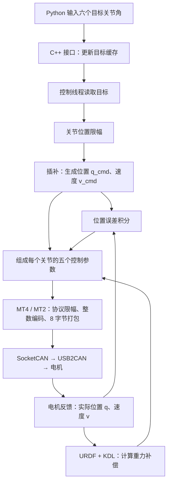

# ARX X5 Python SDK：从目标位置到电机 CAN 帧的数据流

更新时间：2026-10-04。

本文说明本工程固定版本 Python SDK 的实际行为，包括目标缓存、关节限幅、插补、
重力补偿、误差积分、协议量化、CAN 打包和发送。核心实现位于闭源动态库，
相关结论由公开接口、常量和静态反汇编交叉确认；没有连接机械臂或发送 CAN。

## 1. 版本和适用范围

- SDK 来源：<https://gitee.com/li-bozha0/ARX_X5>
- 固定提交：`c78328785ea23a81d908e1dcc551eca992f2f1e9`
- 核心库：`vendor/ARX_X5/py/arx_x5_python/bimanual/lib/arx_x5_src/libarx_x5_src.so`
- 核心库 SHA256：`cb51e1acfccd1e904ca263d45db2035fb33a457ded0b64e5376a864aaf1abeb5`
- 架构：Linux x86_64。

本文以正常六轴关节位置控制为主，不混用旧 ROS/ROS2 动态库的控制逻辑。
它也不代表独立 ENCOS 驱动的修正已经应用到厂商 `.so`。
主应用的串口解码、授权状态机和额外限速位于 SDK 之前，不属于下文的厂商计算链。

## 2. 总体数据流



不支持 Mermaid 的阅读器可以按下面的顺序理解：

```text
目标关节角 → 缓存交换 → 限幅 → 插补位置/速度
                                      ↓
实际关节角 → 重力补偿 ───────────────→ 五参数命令
实际关节角 + 插补位置 → 误差积分 ─────→ 五参数命令
                                      ↓
                     电机协议限幅 → 量化 → 打包 → SocketCAN
```

## 3. Python 输入如何进入控制线程

厂商封装的调用方式是：

```python
arm.set_joint_positions([q1, q2, q3, q4, q5, q6])
```

输入是六个关节的**绝对目标角度，单位 rad**，不是角度增量或编码器计数。
应提供完整六维数据；不要根据 Python 类型注解推断底层支持标量广播。

`SingleArm.set_joint_positions()` 内部执行：

```python
self.arm.set_joint_positions(positions)
self.arm.set_arm_status(5)  # POSITION_CONTROL
```

直接使用底层 `InterfacesPy` 时，设置目标和切换控制状态是两个接口。
入口见 [single_arm.py](vendor/ARX_X5/py/arx_x5_python/bimanual/script/single_arm.py)，
绑定见 [single_arm_interface.cpp](vendor/ARX_X5/py/arx_x5_python/bimanual/src/single_arm_interface.cpp)。

```text
SingleArm.set_joint_positions()
  → pybind11 绑定
  → InterfacesPy::set_joint_positions()
  → InterfacesThread::setJointPositions()
  → ControllerThread::setJointPositions()
  → 目标缓存
```

底层保存六个位置，再通过互斥锁保护的缓存交换交给控制线程。
**一次 Python 调用不等于立即发送一次 CAN 帧**：后台线程持续根据最近一次目标计算和发送。

正常运行时，每轮线程执行顺序为：

```text
read()          获取反馈，计算重力补偿和正运动学
update()        执行当前控制模式，生成命令并加入积分
write()         检查状态、组帧、发送
exchangeData()  交换外部输入目标和对外反馈缓存
```

外部目标在循环末尾交换，新目标通常由后续一轮计算使用。
线程在本轮末尾读取时钟，等待耗时达到 **5000 μs** 后进入下一轮，
目标周期约 **5 ms / 200 Hz**；这是代码中的节拍，不是硬实时保证。
计算、发送、错误处理或操作系统调度超时会延长周期。
Python 包装器的 `self.dt` 不能当作此 C++ 线程的实际周期。

以上描述适用于初始化完成后的正常控制；构造控制器会启动硬件线程并执行初始化动作。

## 4. 目标关节角限幅

正常位置控制先执行：

\[
q_{\mathrm{target},i}
=\operatorname{clamp}(q_{\mathrm{input},i},q_{\min,i},q_{\max,i})
\]

本版本的关节映射、限位与控制增益：

| 关节 | CAN ID | 电机类型 | 目标角范围 / rad | Kp | Kd | Ki |
| --- | ---: | --- | --- | ---: | ---: | ---: |
| J1 | 1 | MT4 | −2.618 ～ 3.14 | 150 | 1 | 50 |
| J2 | 2 | MT4 | −0.1 ～ 3.6 | 150 | 1 | 50 |
| J3 | 4 | MT4 | −0.1 ～ 3.0 | 150 | 1 | 50 |
| J4 | 5 | MT2 | −1.57 ～ 1.57 | 50 | 0.8 | 0 |
| J5 | 6 | MT2 | −1.57 ～ 1.57 | 25 | 0.8 | 0 |
| J6 | 7 | MT2 | −1.97 ～ 2.08 | 10 | 1 | 0 |

例如 J2 输入 `4.0 rad`，后续使用 `3.6 rad`。
这些是控制器的目标限制，不能拿 URDF 中的通用 `limit` 字段替代，
也不能把目标限幅理解成已经保证实际关节永远不会越界。

参数来源见 [SDK 参数说明](gravity_compensation/sdk_parameters/README.md)
和 [原始参数 JSON](gravity_compensation/sdk_parameters/parameters.json)。

## 5. 插补位置和速度

三个位置变量的含义不同：

| 符号 | 含义 |
| --- | --- |
| `q_t` | 限幅后的最终目标位置 |
| `q_c` | SDK 内部保存的插补位置 |
| `q` | 电机实际反馈位置 |

插补使用 `q_t - q_c`；后面的误差积分使用实际反馈 `q`。

厂商 Python 初始化调用：

```python
self.arm.arx_x(500, 2000, 10)
```

前两个参数除以 1000，再分别限幅：

\[
a=\operatorname{clamp}(500/1000,0,0.5)=0.5
\]

\[
v_{\max}=\operatorname{clamp}(2000/1000,0,2)=2
\]

第三个参数在此版本没有被使用。

每个关节的插补先计算：

\[
e=q_t-q_c,\qquad d=\frac{v_{\max}^{2}}{2a}
\]

对正常正参数 `a > 0`、`v_max > 0`，二进制对应的速度计算为：

\[
v_{\mathrm{cmd}}=\operatorname{sgn}(e)
\begin{cases}
\sqrt{2a|e|},&|e|<d\\
\sqrt{v_{\max}^{2}-2a(|e|-d)},&d\leq|e|\leq2d\\
v_{\max},&|e|>2d
\end{cases}
\]

然后更新位置并保存为下一轮的 `q_c`：

\[
q_{\mathrm{cmd}}=q_c+0.03\,v_{\mathrm{cmd}}
\]

等价伪代码如下，便于不支持公式的阅读器查看：

```python
error = target - interpolated_position
distance = abs(error)
braking_distance = max_velocity**2 / (2 * acceleration)

if distance < braking_distance:
    speed = sqrt(2 * acceleration * distance)
elif distance <= 2 * braking_distance:
    speed = sqrt(max_velocity**2
                 - 2 * acceleration * (distance - braking_distance))
else:
    speed = max_velocity

velocity_command = speed if error > 0 else -speed
interpolated_position += 0.03 * velocity_command
```

**线程目标周期为 5 ms，但位置插补固定乘以 0.03。**
不能把它解释成标准的 5 ms 梯形轨迹，也不能认为 `v_max=2` 已经保证
插补位置每秒最多变化 2 rad。中间分支同样是原实现的公式，不能自行替换成常见规划公式。
此函数没有在每轮显式保证位置恰好停在最终目标，故不能把输入限幅当作完整轨迹边界保证。
插补计算主要采用 float，随后写回 double。

接口虽然允许参数被限制到 0，上面的公式不能用于声称零参数也具有正常轨迹语义；
原函数中的除法并未由该接口消除。

## 6. 根据实际姿态计算重力补偿

`read()` 将六个实际反馈角度送入 KDL：

```text
实际角度 → KDL::JntArray → ChainDynParam::JntToGravity() → 六轴补偿结果
```

模型从对应 URDF 加载，取 `base_link → link6` 的链，重力为：

\[
\mathbf g=(0,0,-9.81)
\]

静态重力补偿可理解为对各连杆重力所产生关节力矩的抵消：

\[
\tau_{g,i}=-\sum_j J_{v,j,i}(q)^\mathsf T m_j\mathbf g
\]

`m_j` 为连杆质量，`J_v,j,i` 是该连杆质心位置对第 i 个关节角的变化率。
KDL 实际采用递归牛顿欧拉算法，将速度、加速度和外部载荷输入置零后求解。

SDK 对结果逐轴缩放：

\[
\tau_{g,\mathrm{SDK}}=
\operatorname{diag}(0.8,0.8,0.8,1.32,1.32,1.32)\tau_{g,\mathrm{KDL}}
\]

因此重力补偿依赖整条机械臂的实际姿态，以及 URDF 中的质量、质心和几何关系。
不能只由某个关节自己的目标角度计算该关节的补偿。
这些经验缩放系数的标定含义没有从 SDK 中确认。

来源和复核地址见 [重力计算 PROVENANCE](gravity_compensation/PROVENANCE.md)。

## 7. 加入积分并形成五参数命令

正常位置控制先填入：

```cpp
position = q_cmd;
velocity = v_cmd;
torque   = gravity_compensation;
k_p      = joint_kp;
k_d      = joint_kd;
```

随后 `update()` 加入积分。`Kp > 0` 时：

\[
I_i[k]=\operatorname{clamp}\left(
I_i[k-1]+\frac{q_{\mathrm{cmd},i}[k]-q_i[k]}{200},-5,5\right)
\]

\[
u_{\mathrm{ff},i}=\tau_{g,\mathrm{SDK},i}+K_{i,i}I_i[k]
\]

`Kp ≤ 0` 时对应积分状态清零。等价核心运算为：

```python
if kp > 0:
    integral = clamp(integral + (q_cmd - q_feedback) / 200, -5, 5)
else:
    integral = 0
effort_command = scaled_gravity + ki * integral
```

- 误差是“插补位置 − 实际位置”，不是“最终目标 − 实际位置”。
- 积分状态限幅 ±5，不是最终前馈量限幅 ±5。
- J1～J3 的 Ki=50；J4～J6 的 Ki=0，因此后面三轴不增加积分输出。
- 积分使用固定 `/200`，没有根据实际循环耗时动态计算时间步长。
- 最终前馈量还会经过协议层限幅。

最终结构体见 [HybridJointTypeDef.hpp](vendor/ARX_X5/py/arx_x5_python/bimanual/lib/arx_hardware_interface/include/arx_hardware_interface/typedef/HybridJointTypeDef.hpp)：

```cpp
struct HybridJointCmd {
    double position;  // 插补位置
    double velocity;  // 插补速度
    double torque;    // 重力补偿 + 积分补偿
    double k_p;
    double k_d;
};
```

Kp、Kd 与位置、速度一起发给电机；此处没有把所有项合成一个最终电流命令。
混合控制的意图可写成：

\[
u\sim K_p(q_{\mathrm{cmd}}-q)+K_d(v_{\mathrm{cmd}}-v)+u_{\mathrm{ff}}
\]

此式用于解释参数职责，不代表已经确认电机固件内部的电流环实现和限幅。
SDK 将前馈字段命名为 `torque`，但这条路径没有明确的 `电流=力矩/Kt` 换算。
它还把同一反馈 effort 同时写入 `torque` 和 `current`。
因此不能仅凭字段名认定物理单位；对接 ENCOS 时需要依据具体型号明确量程与单位。

## 8. 电机协议层限幅与整数编码

`write()` 调用的五参数重载顺序为：

```cpp
motor->packMotorMsg(kp, kd, position, velocity, effort);
```

J1～J3 使用 `MotorType4`；J4～J6、夹爪使用 `MotorType2`。

MT4 先修正发送位置：

\[
p=q_{\mathrm{cmd}}-\mathrm{offset}+\mathrm{wrap\_flag}\times2\pi
\]

默认 offset=0；wrap_flag 来自反馈位置修正逻辑，随后位置限制到 ±12.5。
不要把这里的 2π 修正与反馈解码中的跨量程计圈混为一谈。
MT2 的发送路径直接对输入位置限幅。

| 字段 | MT4 范围 | MT2 范围 | SDK 量化位数 |
| --- | --- | --- | ---: |
| 位置 P | −12.5 ～ 12.5 | −12.5 ～ 12.5 | 16 |
| 速度 V | −18 ～ 18 | −45 ～ 45 | 12 |
| Kp | 0 ～ 500 | 0 ～ 500 | 12 |
| Kd | 0 ～ 50 | 0 ～ 5 | 12 |
| 前馈 T | −30 ～ 30 | −10 ～ 10 | 12 |

这些是编码范围，不等于电机额定能力。先限幅，再量化：

\[
X=\operatorname{trunc}\left(
\frac{(x-x_{\min})(2^n-1)}{x_{\max}-x_{\min}}
\right)
\]

```python
x = min(max(x, x_min), x_max)
encoded = int((x - x_min) * ((1 << bits) - 1) / (x_max - x_min))
```

原函数使用 float 运算并截断取整；上面 Python 表达式只表示数学关系，
需要逐位复现时还要匹配单精度舍入。

例如 MT4：

```text
Kp=150 → int(150×4095/500) = 1228
Kd=1   → int(1×4095/50)   = 81
```

## 9. 八字节 CAN 数据布局

以下 P、V、KP、KD、T 均为整数编码。赋给字节时保留低 8 位。

### 9.1 MT4：J1～J3

```cpp
data[0] = KP >> 7;
data[1] = ((KP & 0x7F) << 1) | ((KD >> 8) & 0x01);
data[2] = KD & 0xFF;
data[3] = P >> 8;
data[4] = P & 0xFF;
data[5] = V >> 4;
data[6] = ((V & 0x0F) << 4) | ((T >> 8) & 0x0F);
data[7] = T & 0xFF;
```

```text
3 位模式 | 12 位 Kp | 9 位 Kd | 16 位位置 | 12 位速度 | 12 位前馈
```

本实现模式位为 `000`。

**Kd 按 12 位量化，却只打包低 9 位。**超出的高位丢失，不是饱和到 9 位最大值。
因此不能把此原始 SDK 实现视为已经正确实现的 ENCOS 编码。
独立驱动的修正不会自动修改此厂商动态库。

### 9.2 MT2：J4～J6、夹爪

```cpp
data[0] = P >> 8;
data[1] = P & 0xFF;
data[2] = V >> 4;
data[3] = ((V & 0x0F) << 4) | ((KP >> 8) & 0x0F);
data[4] = KP & 0xFF;
data[5] = KD >> 4;
data[6] = ((KD & 0x0F) << 4) | ((T >> 8) & 0x0F);
data[7] = T & 0xFF;
```

```text
16 位位置 | 12 位速度 | 12 位 Kp | 12 位 Kd | 12 位前馈
```

两种电机均发送 DLC=8 的普通控制帧，但参数排列不同，不能共用一种打包顺序。

## 10. J2 完整计算示例

以下是用于演示的假设输入，不是实机测试指令：

```text
输入目标位置：       0.210 rad
上轮插补位置：       0.200 rad
实际反馈位置：       0.200 rad
上轮积分状态：       0
KDL 原始重力结果：   1.000（假设值；实值由完整六轴姿态决定）
MT4 offset / wrap：  0 / 0
```

1. J2 目标在范围内，保持 0.210。
2. `e=0.210−0.200=0.010`，`d=2²/(2×0.5)=4`。
3. `v_cmd=sqrt(2×0.5×0.010)=0.100`。
4. `q_cmd=0.200+0.03×0.100=0.203`。
5. 缩放重力结果 `0.8×1.000=0.800`。
6. 积分 `I=(0.203−0.200)/200=0.000015`。
7. 前馈 `u_ff=0.800+50×0.000015=0.80075`。

| 参数 | 浮点值（近似） | 整数编码 |
| --- | ---: | ---: |
| position | 0.203 | 33299 |
| velocity | 0.100 | 2058 |
| Kp | 150 | 1228 |
| Kd | 1 | 81 |
| effort | 0.80075 | 2102 |

按 MT4 格式打包：

```text
CAN ID: 0x002
DLC:    8
DATA:   09 98 51 82 13 80 A8 36
```

这组字节复现的是原 SDK 的编码行为，包括其 Kd 处理方式；
不意味着已经完成具体 ENCOS 型号的协议和物理单位匹配。

## 11. 从组帧到 USB2CAN

```text
ControllerBase::write()
  → MotorType4/2::packMotorMsg()
  → SocketCan::ExchangeData()
  → SocketCan::impl::ExchangeData()
  → write(socket_fd, frame, 16)
  → Linux CAN 网络设备
  → USB2CAN
  → CAN 总线
```

系统调用中的 16 是经典 CAN 帧的 SocketCAN 结构体大小，**有效载荷仍为 8 字节**。
主机写入成功表示数据交给内核，不等于已经收到电机的执行确认。
USB2CAN 必须通过适当驱动或适配层呈现为 SDK 使用的 CAN 网络接口，
例如 `can0`；遥操作器的串口是另一条链路。

正常循环依次发送七个电机：

```text
关节：  J1  J2  J3  J4  J5  J6  夹爪
ID：     1   2   4   5   6   7    8
```

每帧发送后调用 `usleep(200)`，请求等待 200 μs，实际等待可能更长。
七个命令逐帧发送，并非同时到达。
SocketCAN 写缓冲区不足时存在等待和重试路径，也可能延长循环。

`write()` 还检查通信在线、错误码和反馈阈值，异常处理可能改写为保护命令。
夹爪由独立的 `CatchPositionCtrl()` 生成命令，不使用六轴相同的插补与重力链路。
不同 arm_type 的夹爪行为见 [SDK 参数说明](gravity_compensation/sdk_parameters/README.md)。

接收线程解析电机反馈；后续 `read()` 用更新后的实际角度重算重力，
`update()` 再计算插补和积分，形成持续控制过程。
缓存读取本身不等于反馈一定新鲜，公开 Python 接口没有提供每帧反馈时间戳。

## 12. 其他输入和模式

- `set_ee_pose()`：先经过末端位姿约束、逆运动学和关节范围处理，
  再进行关节插补、补偿和 CAN 编码；不是直接把 xyz 发给电机。
- `GO_HOME`：使用独立复位目标和插补参数，不应套用普通位置目标限幅的全部结论。
- `G_COMPENSATION`：六轴 Kp/Kd 为零，发送重力补偿，夹爪走 CatchSoft。
- `SOFT`：零力矩控制语义，不是真正电机失能，不能与重力补偿模式混用概念。

## 13. 证据位置和复核方法

公开接口及已保存资料：

| 文件 | 内容 |
| --- | --- |
| [single_arm.py](vendor/ARX_X5/py/arx_x5_python/bimanual/script/single_arm.py) | Python 入口、模式切换、arx_x 初始化 |
| [single_arm_interface.cpp](vendor/ARX_X5/py/arx_x5_python/bimanual/src/single_arm_interface.cpp) | pybind11 绑定 |
| [HybridJointTypeDef.hpp](vendor/ARX_X5/py/arx_x5_python/bimanual/lib/arx_hardware_interface/include/arx_hardware_interface/typedef/HybridJointTypeDef.hpp) | 命令与反馈结构体 |
| [sdk_parameters.asm](gravity_compensation/sdk_parameters/reference/sdk_parameters.asm) | 位置控制、积分、插补、MT2/MT4 打包证据 |
| [参数说明](gravity_compensation/sdk_parameters/README.md) | 参数表和已知实现限制 |
| [parameters.json](gravity_compensation/sdk_parameters/parameters.json) | 常量地址、原始参数 |
| [PROVENANCE.md](gravity_compensation/PROVENANCE.md) | 重力计算和 KDL 来源 |

以下为本版本动态库中的虚拟地址，其他编译版本不可照搬：

| 地址 | 函数或常量 |
| --- | --- |
| `0x18810` | ControllerThread::setJointPositions |
| `0x188c0` | ControllerThread::exchangeData |
| `0x18b00` | ControllerThread::ArmThread；read → update → write → exchangeData |
| `0x32820` | double 5000.0；线程循环耗时阈值，单位 μs |
| `0x132c0` | ControllerBase::statePositionControl |
| `0x14620` | ControllerBase::update，含积分处理 |
| `0x152a0` | ControllerBase::read |
| `0x155c0` | ControllerBase::write，含七电机循环与 usleep(200) |
| `0x1a3a0` | InterfacesThread::arx_x |
| `0x29a30` | Interpolation |
| `0x2c120` | computeGravityCompensationTorque |
| `0x2e05a` | MotorType2::packMotorMsg 五 double 重载 |
| `0x2f170` | MotorType4::packMotorMsg 五 double 重载 |
| `0x2fcc6` | SocketCan::impl::ExchangeData(CanFrame*) |

在项目根目录可以只读复核，无需加载或构造控制器：

```bash
sha256sum vendor/ARX_X5/py/arx_x5_python/bimanual/lib/arx_x5_src/libarx_x5_src.so

objdump -d -C --no-show-raw-insn \
  --start-address=0x18b00 --stop-address=0x18bb8 \
  vendor/ARX_X5/py/arx_x5_python/bimanual/lib/arx_x5_src/libarx_x5_src.so

objdump -s --start-address=0x32820 --stop-address=0x32828 \
  vendor/ARX_X5/py/arx_x5_python/bimanual/lib/arx_x5_src/libarx_x5_src.so
```

本文是现有实现说明，不是硬件执行验证，也不提供未知的电机型号、Kt、减速比或固件内环参数。
